# otus-linux
Vagrantfile - для стенда урока 9 - Network

# Дано
Vagrantfile с начальным  построением сети
inetRouter
centralRouter
centralServer

тестировалось на virtualbox

# Планируемая архитектура
построить следующую архитектуру

Сеть office1
- 192.168.2.0/26      - dev
- 192.168.2.64/26    - test servers
- 192.168.2.128/26  - managers
- 192.168.2.192/26  - office hardware

Сеть office2
- 192.168.1.0/25      - dev
- 192.168.1.128/26  - test servers
- 192.168.1.192/26  - office hardware


Сеть central
- 192.168.0.0/28    - directors
- 192.168.0.32/28  - office hardware
- 192.168.0.64/26  - wifi

```
Office1 ---\
      -----> Central --IRouter --> internet
Office2----/
```
Итого должны получится следующие сервера
- inetRouter
- centralRouter
- office1Router
- office2Router
- centralServer
- office1Server
- office2Server

# Теоретическая часть
- Найти свободные подсети
- Посчитать сколько узлов в каждой подсети, включая свободные
- Указать broadcast адрес для каждой подсети
- проверить нет ли ошибок при разбиении

# Практическая часть
- Соединить офисы в сеть согласно схеме и настроить роутинг
- Все сервера и роутеры должны ходить в инет черз inetRouter
- Все сервера должны видеть друг друга
- у всех новых серверов отключить дефолт на нат (eth0), который вагрант поднимает для связи
- при нехватке сетевых интервейсов добавить по несколько адресов на интерфейс


# 1. Теоретическая часть

## Найти свободные подсети.

|Подсеть|Min IP|Max IP|Broadcast|Hosts|Mask|
|---|---|---|---|:---:|---|
|192.168.0.16/28|192.168.0.17|192.168.0.30|192.168.0.31|14|255.255.255.240|
|192.168.0.48/28|192.168.0.49|192.168.0.62|192.168.0.63|14|255.255.255.240|
|192.168.0.128/25|192.168.0.129|192.168.0.254|192.168.0.254|126|255.255.255.128|

##  Посчитать сколько узлов в каждой подсети, включая свободные. Указать broadcast адрес для каждой подсети.

### Office1

|Название|Подсеть|Broadcast|Hosts|Mask|
|---|---|---|:---:|---|
|dev|192.168.2.0/26|192.168.2.63|62|255.255.255.192|
|test servers|192.168.2.64/26|192.168.2.127|62|255.255.255.192|
|managers|192.168.2.128/26|192.168.2.191|62|255.255.255.192|
|office hardware|192.168.2.192/26|192.168.2.255|62|255.255.255.192|

### Office2

|Название|Подсеть|Broadcast|Hosts|Mask|
|---|---|---|:---:|---|
|dev|192.168.1.0/25|192.168.1.127|126|255.255.255.128|
|test servers|192.168.1.128/26|192.168.1.191|62|255.255.255.192|
|office hardware|192.168.1.192/26|192.168.1.255|62|255.255.255.192|


### Central

|Название|Подсеть|Broadcast|Hosts|Mask|
|---|---|---|:---:|---|
|directors|192.168.0.0/28|192.168.0.15|14|255.255.255.240|
|office hardware|192.168.0.32/28|192.168.0.47|14|255.255.255.240|
|wifi|192.168.0.64/26|192.168.0.127|62|255.255.255.192|

Ошибок при разбиении нет.


# 2. Практическая часть

Схема сети

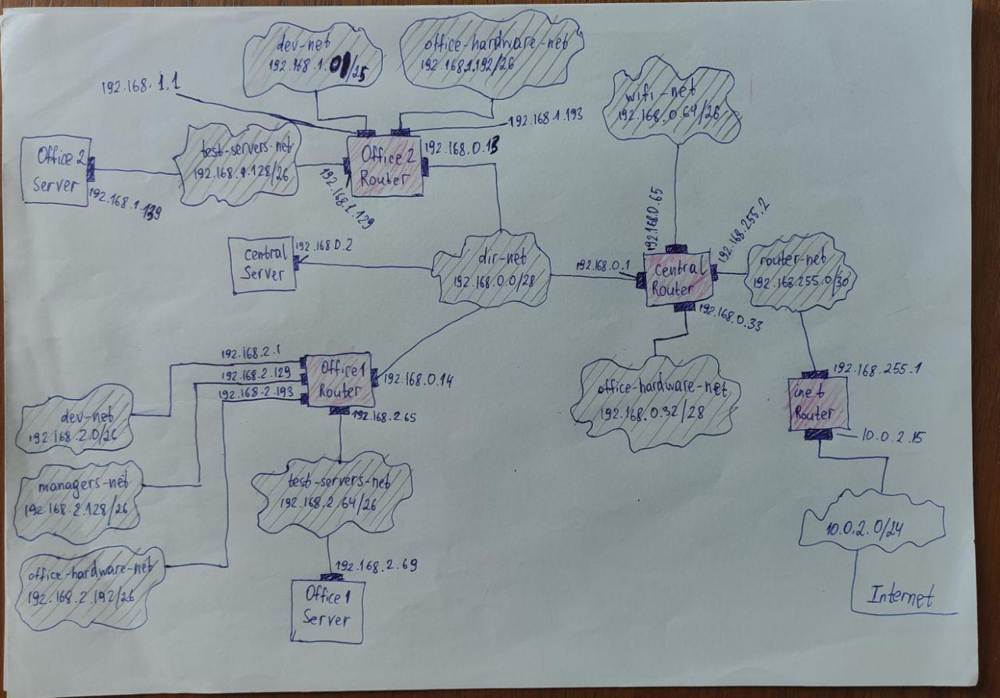

## Соединить офисы в сеть согласно схеме и настроить роутинг

Сетевые настройки CentralRouter

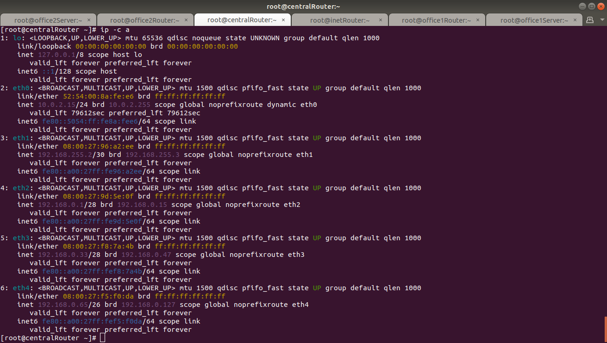
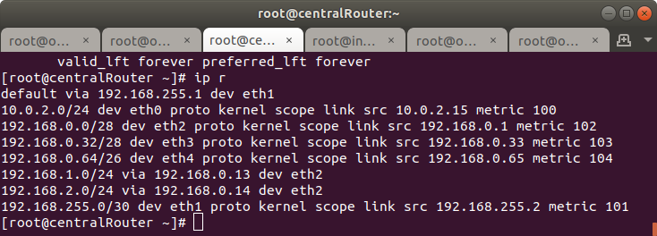

Сетевые настройки Office1Router

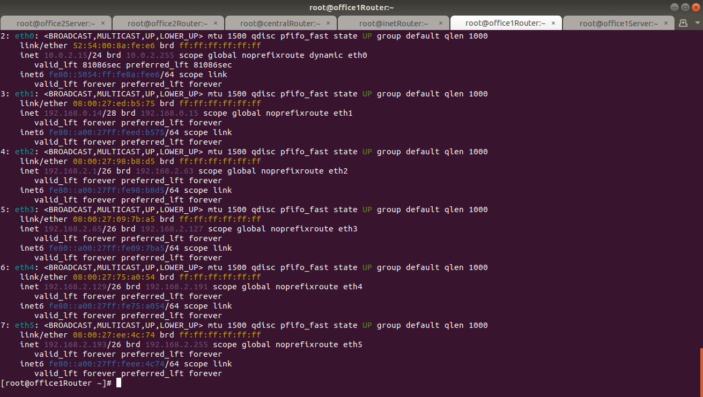
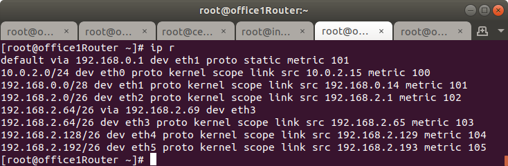

Сетевые настройки Office1Server

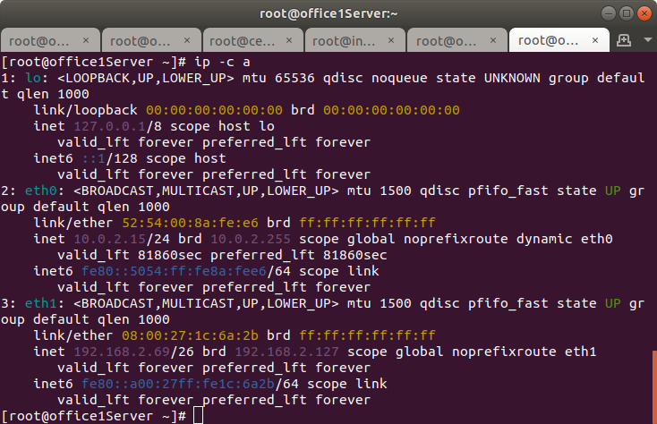
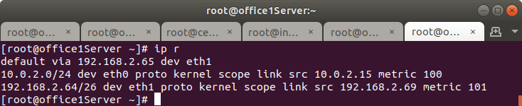

Сетевые настройки Office2Router

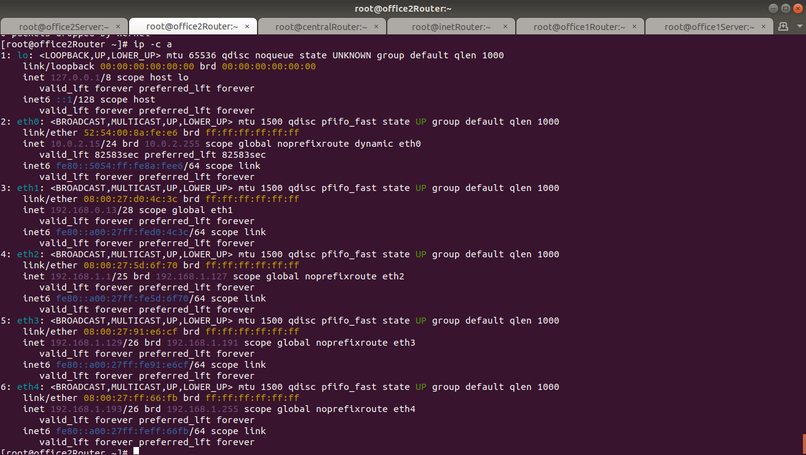
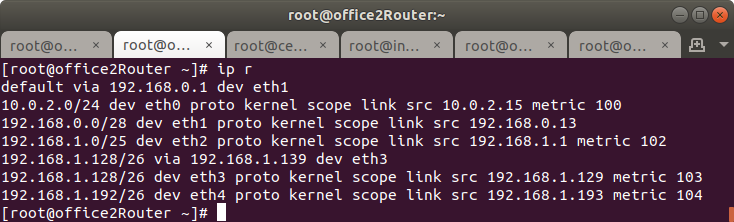

Сетевые настройки Office2Server

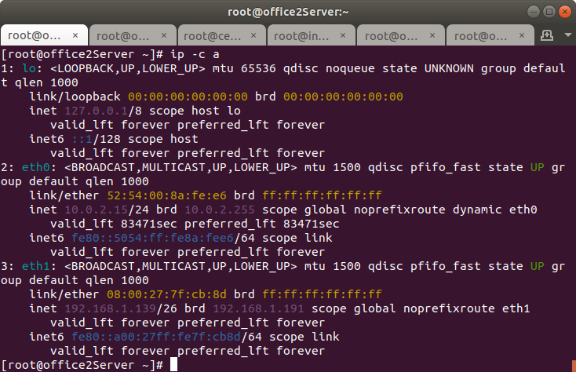
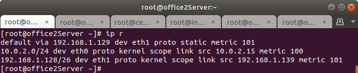

## Все сервера и роутеры должны ходить в инет черз inetRouter

Office2Server

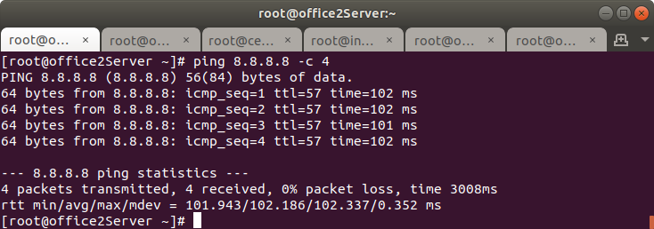
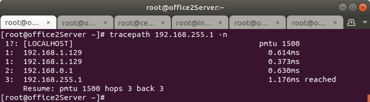

Office1Server
g
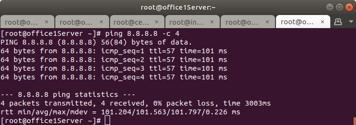
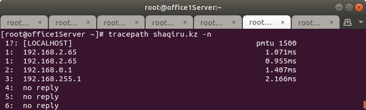

## Все сервера должны видеть друг друга

Offic1Server => CentralServer
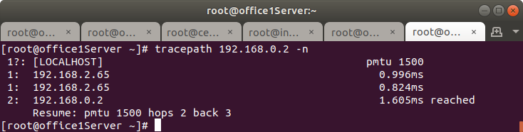

Offic2Server => Offic1Server
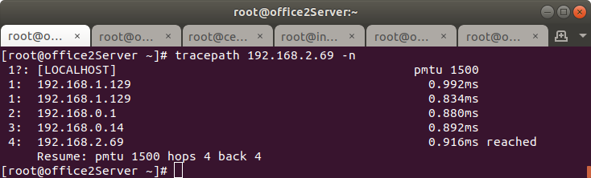

CentralServer => Offic1Server
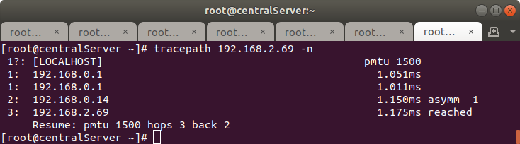

## у всех новых серверов отключить дефолт на нат (eth0), который вагрант поднимает для связи

Отключаем дефолтный маршрут командной:

```
echo "DEFROUTE=no" >> /etc/sysconfig/network-scripts/ifcfg-eth0 
```

Добавляем необходимый нам gateway исходя из конфигурации наших сетей (например, office1Server):

```
echo "GATEWAY=192.168.2.1" >> /etc/sysconfig/network-scripts/ifcfg-eth1
```
