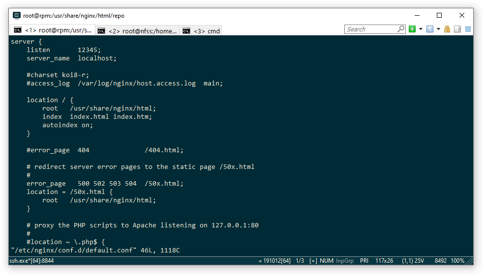
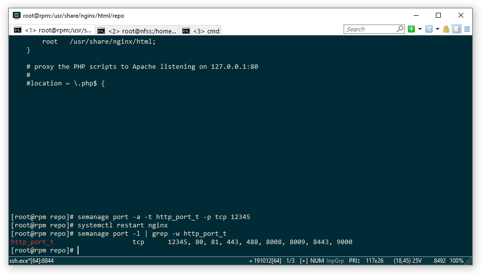
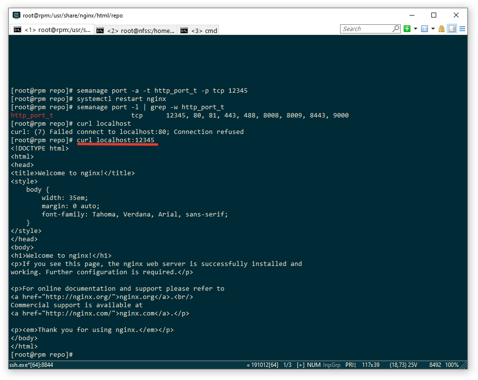
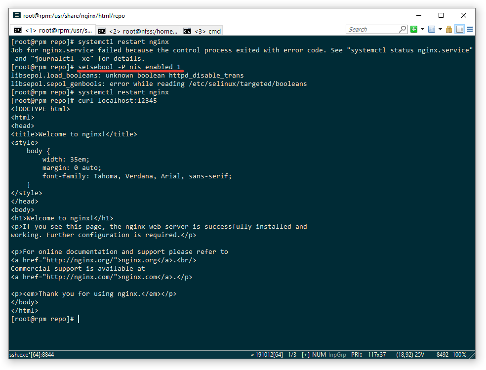
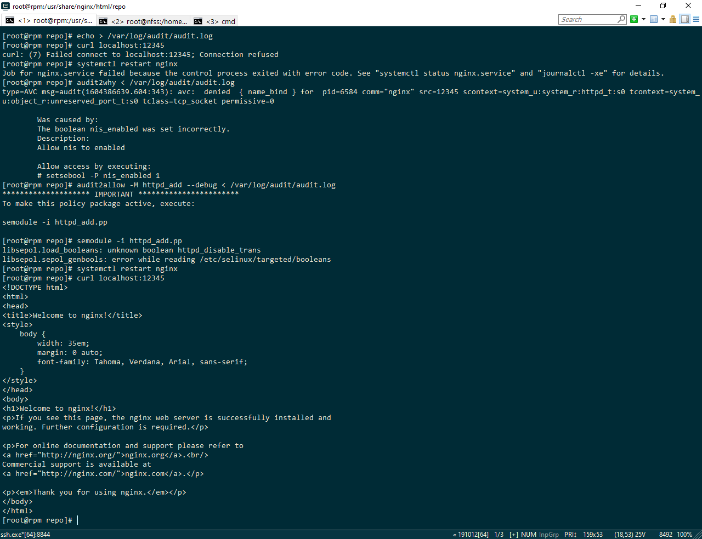
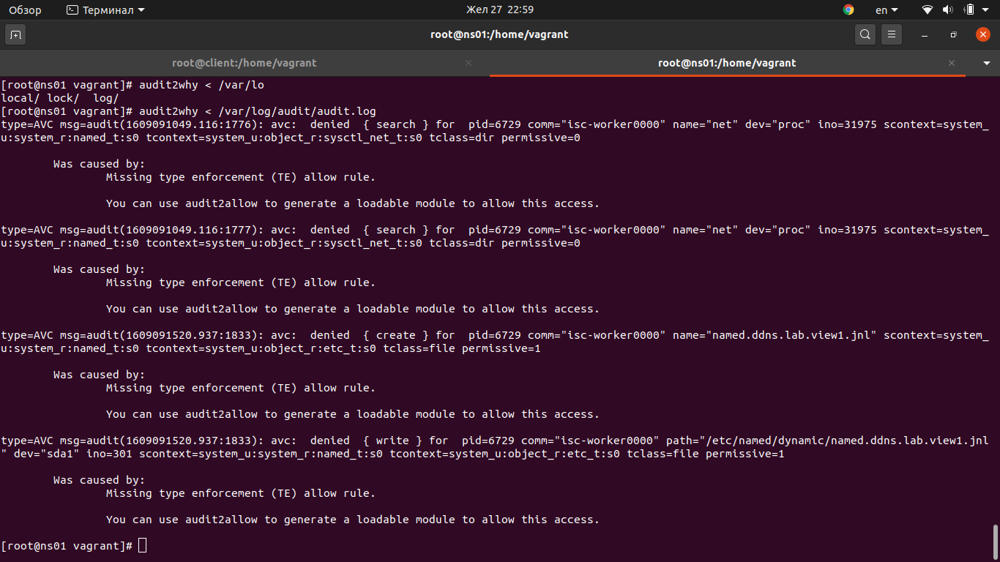
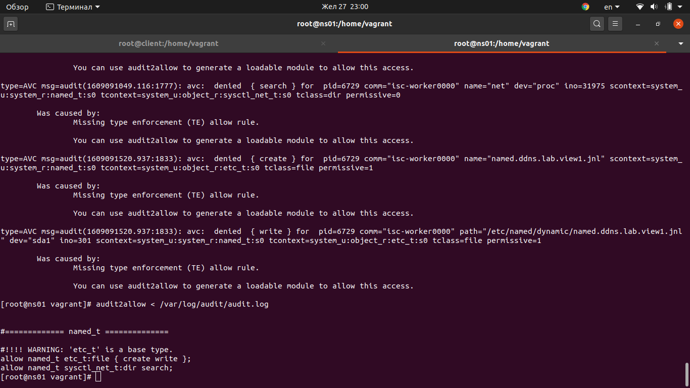
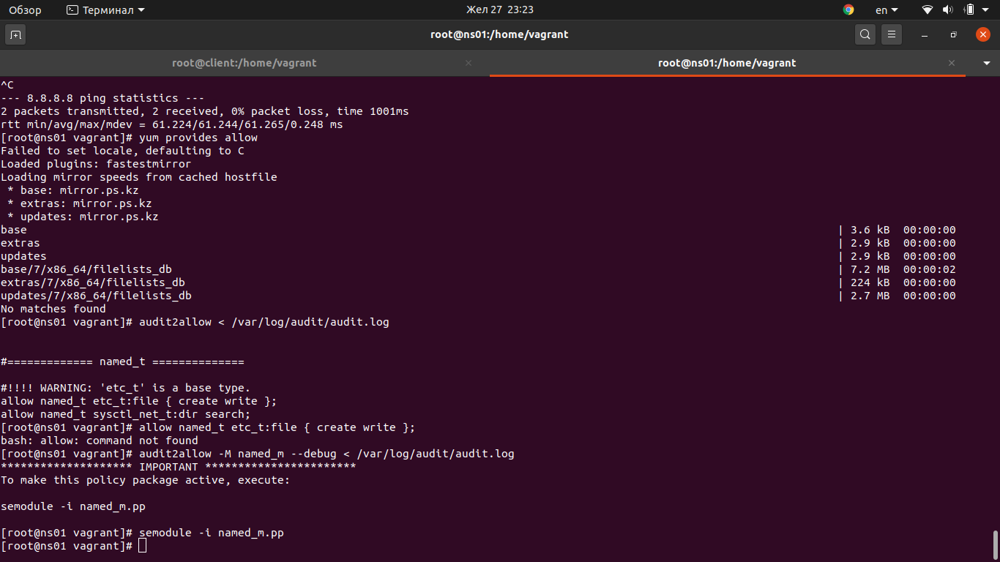
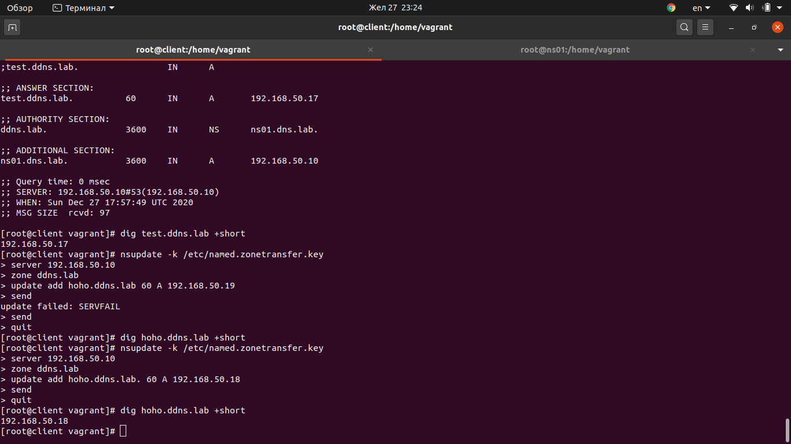

### SELinux: проблема с удаленным обновлением зоны DNS


# 1. Запустить nginx на нестандартном порту 3-мя разными способами:

1.1 Меняем порт в конфиге nginx


1.2 Добавляем нестандартный порт в тип http_port_t командой - semanage port -a -t http_port_t -p tcp 12345

Проверяем


1.3 Разшешаем использовать нестандартный порт с помощбю переключателя setsebool;
Меняем порт на нестандартный пробуем рестартануть nginx, но не разрешает selinux
Поменяем значение переключателя nis_enabled в положение 1 или on. Это даст нам возможность запустить nginx на не стандартном порту


1.4 Формирование и установка модуля SELinux.
Для формирования модуля воспользуемся утилитой audit2allow:
audit2allow-M httpd_add --debug < /var/log/audit/audit.log
Устанавливаем сгенерированный модуль: 
semodule -i httpd_add.pp
Перезапускаем nginx, проверяем

 


# 2. Инженер настроил следующую схему:

- ns01 - DNS-сервер (192.168.50.10);
- client - клиентская рабочая станция (192.168.50.15).

При попытке удаленно (с рабочей станции) внести изменения в зону ddns.lab происходит следующее:
```bash
[vagrant@client ~]$ nsupdate -k /etc/named.zonetransfer.key
> server 192.168.50.10
> zone ddns.lab
> update add www.ddns.lab. 60 A 192.168.50.15
> send
update failed: SERVFAIL
>
```
Инженер перепроверил содержимое конфигурационных файлов и, убедившись, что с ними всё в порядке, предположил, что данная ошибка связана с SELinux.

В данной работе предлагается разобраться с возникшей ситуацией.


# Задание

- Выяснить причину неработоспособности механизма обновления зоны.
- Предложить решение (или решения) для данной проблемы.
- Выбрать одно из решений для реализации, предварительно обосновав выбор.
- Реализовать выбранное решение и продемонстрировать его работоспособность.


2.1 Причина неработоспособности механизма динамического обновления зоны
Смотрим с помощью утилиты audit2why /var/log/audit/audit.log
Видим что для процесса с доменом named_t нет точки входа для объекта с типом sysctl_net_t для десйтвия search
также для этого процесса с доменом named_t запрещены действия create, read по отношению к объектам с типом etc_t


На мой взгляд лучшим решением будет сгенерировать модуль для разрешения этих действий с помощью audit2allow, так как политики перезаписываются и перечитываются на уровне ядра и эти настройки будут действовать и после перезагрузки.




проверяем, создаем ресурсную запись динамически hoho.ddns.lab. 60 A 192.168.50.18

