## Курс "Администратор Linux" OTUS.RU

### Методические указания по выполнению практической работы "Динамическая маршрутизация".

Домашняя работа:  

Для того, чтобы получить практические навыки работы с динамической маршрутизацией, утилитами ip, traceroute, tracepath и развёртыванием простого однозонного OSPF предлагается следующее: 

1. Развернуть 3 виртуальных машины;
2. Объединить эти виртуальные машины разными виртуальными каналами;
3. Настроить OSPFv2 между виртуальными машинами на базе quagga;
4. Настроить асимметричную маршрутизацию;
5. Восстановить симметричную маршрутизацию не уменьшая цену интерфейса из п.4.

Для выполнения потребуется хост виртуализации с поддержкой создания изолированных сетей. Рекомендуется использовать хост с ОС Linux и установленном на нём ПО virtualbox и vagrant. Внутри виртуальных машин также потребуется ОС Linux и установленный пакет quagga.

**Формат сдачи:**
- **Vagrantfile + ansible**  
- **Продемонстрировать работу симметричной/асимметричной маршрутизации скриншотами или выводом консоли**

Готовый к развёртыванию стенд необходимо разместить в git и приложить ссылку на репозиторий в "Чат с преподавателем" в соответствующей теме в Личном кабинете. Репозиторий, соответственно, должен быть публичным. Дополнительные схемы, скриншоты, выводы консоли и комментарии в README приветствуются.

Данные методические указания написаны с учётом того, что внутри ВМ используется дистрибутив CentOS 7 из vagrant box centos/7 версии 1905.1. При использовании другой ОС вам необходимо будет адаптировать указания к используемым ОС и ПО.

На все возникшие вопросы можно получить ответ в переписке в чате с преподавателем или, что более рекомендуется, в slack вашей группы.

### Критерии оценки

- Есть схема с указанием устройств, каналов, интерфейсов и адресов (1 балл); 
- Предоставлен стенд Vagrant с развёртыванием ansible (1 балл);
- Предоставленный стенд имеет корректно настроенную асимметричную маршрутизацию (2 балла);
- Есть описание и демонстрация того, как восстановить симметричную маршрутизация на стенде не уменьшая цены интерфейсов (1 балл).

Выполнение первых трёх пунктов являются необходимым для получения зачета по базовому домашнему заданию.

### Построение схемы сети

При проектировании сети любой сложности является хорошим тоном иметь схемы и таблицы с указанием, как минимум, устройств, каналов, интерфейсов и адресов. В нашем случае это будут 3 программных маршрутизатора на базе linux, объединенных независимыми каналами. При этом, один из этих маршрутизаторов, в отличие от остальных, должен иметь доступ к сети Интернет и будет являться шлюзом для остальных. IP-адресация в пределах независимых каналов должна быть уникальной.  
  
Предлагается использовать следующую схему расположен в директории docs):  
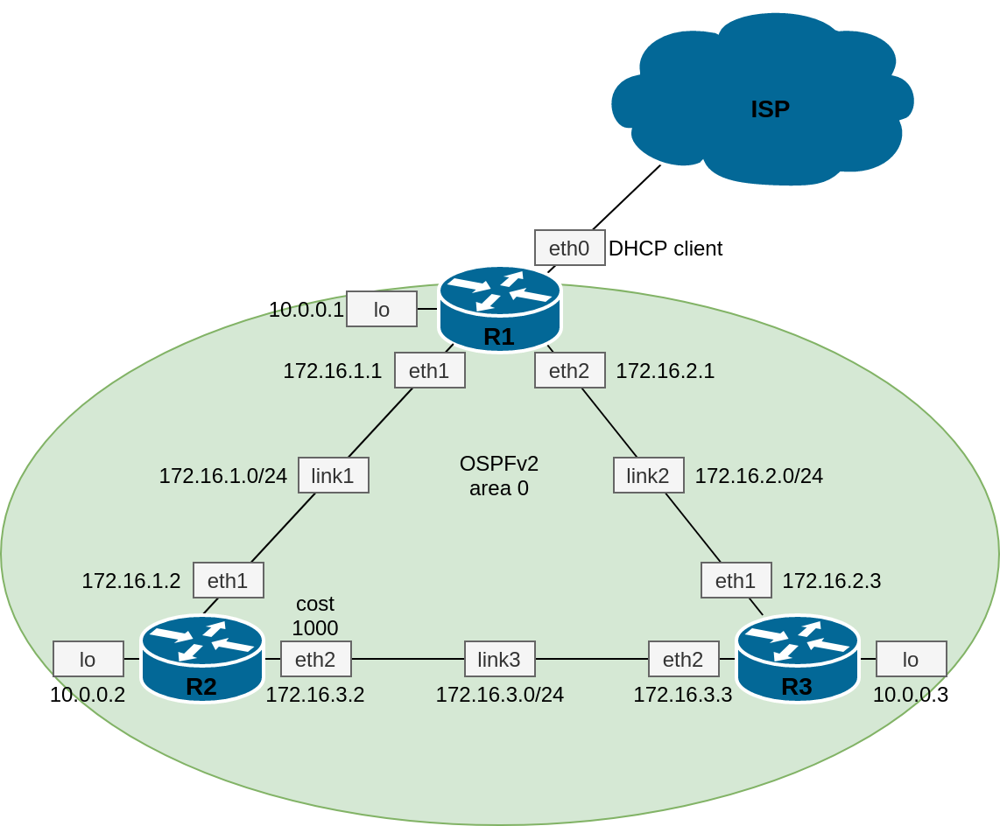

Я расширил эту схему добавив r4 к r3 для тестирования ассиметричного роутинга, так как при отправке пакетов с r3 ассиметрии нет  
  
Таблица соответствия каналов и адресов.  
| Канал | Адресация |
|-------|-----------|
| ISP   | DHCP client    |
| link1 | 172.16.1.0/24 |
| link2 | 172.16.2.0/24 |
| link3 | 172.16.3.0/24 |
| link3 | 172.16.4.0/24 |
  
Таблица адресов на интерфейсах устройств.  
| Устройство | Интерфейс | Адрес |
|------------|-----------|-------|
| R1 | lo | 10.0.0.1/32 | 
| R1 | eth0 | vagrant DHCP | 
| R1 | eth1 | 172.16.1.1/24 |
| R1 | eth2 | 172.16.2.1/24 | 
| R2 | lo | 10.0.0.2/32 | 
| R2 | eth0 | vagrant DHCP | 
| R2 | eth1 | 172.16.1.2/24 |
| R2 | eth2 | 172.16.3.2/24 | 
| R3 | lo | 10.0.0.3/32 | 
| R3 | eth0 | vagrant DHCP | 
| R3 | eth1 | 172.16.2.3/24 |
| R3 | eth2 | 172.16.3.3/24 | 
| R3 | eth3 | 172.16.4.3/24 |
| R4 | eth0 | vagrant DHCP | 
| R4 | eth1 | 172.16.4.4/24 |

##Результат выполнения 

Настройки и таблица маршрутизации r1

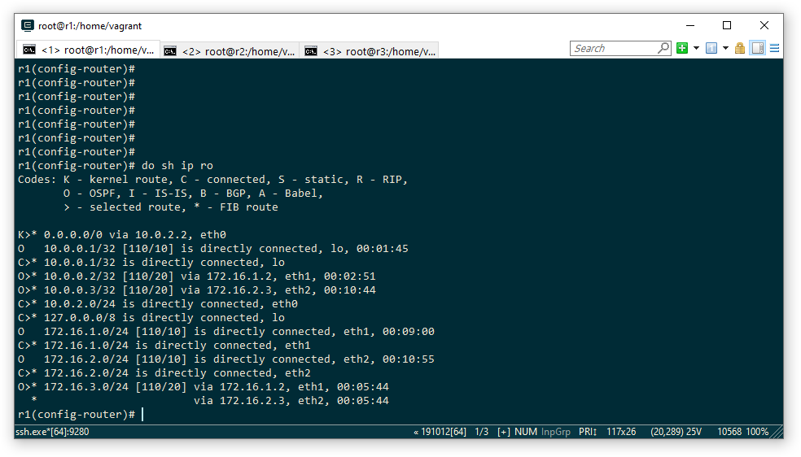
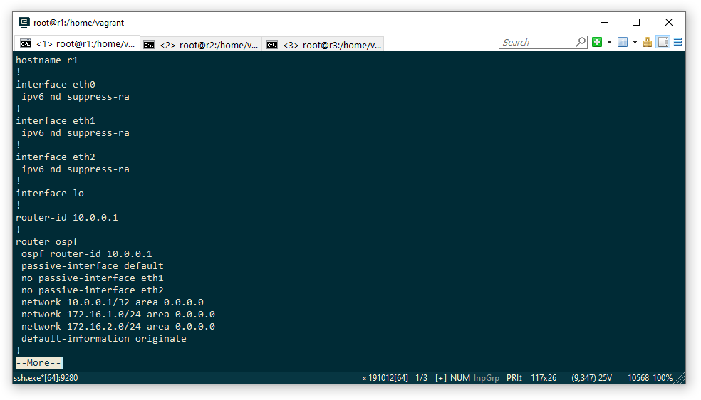

Настройки и таблица маршрутизации r2

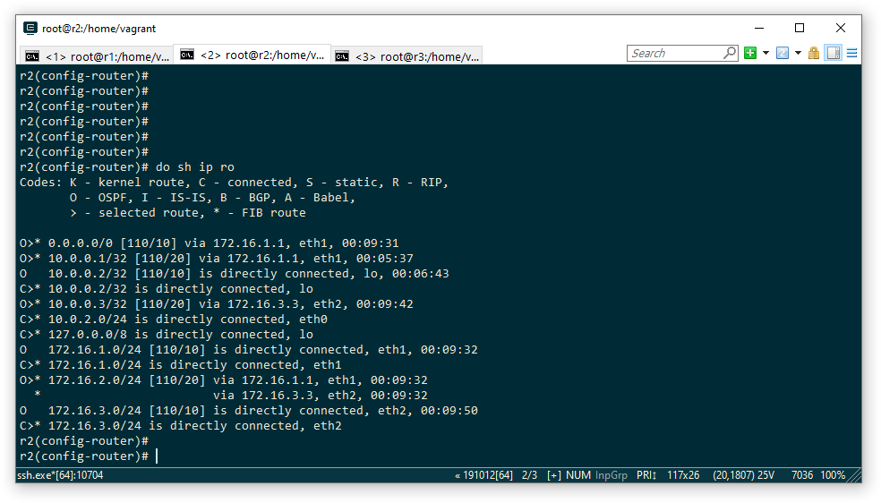
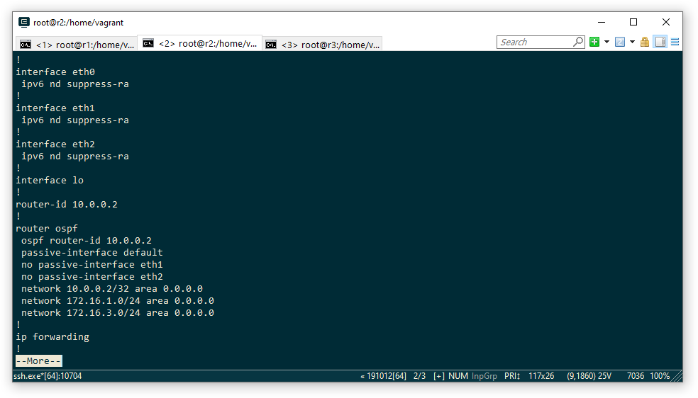

Настройки и таблица маршрутизации r3

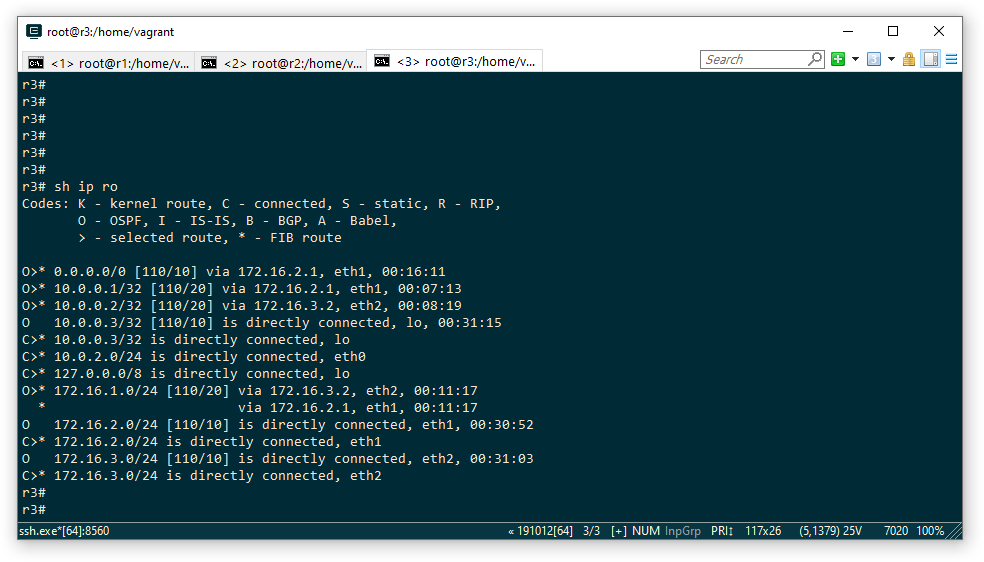
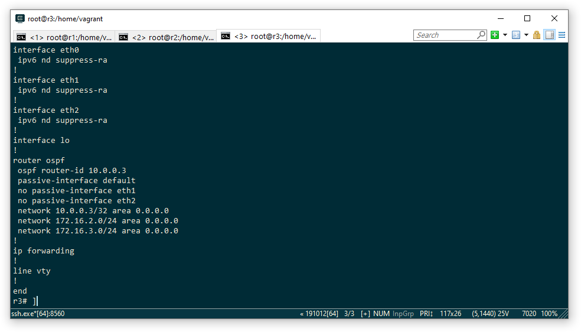

Трассировка 8.8.8.8 с r3

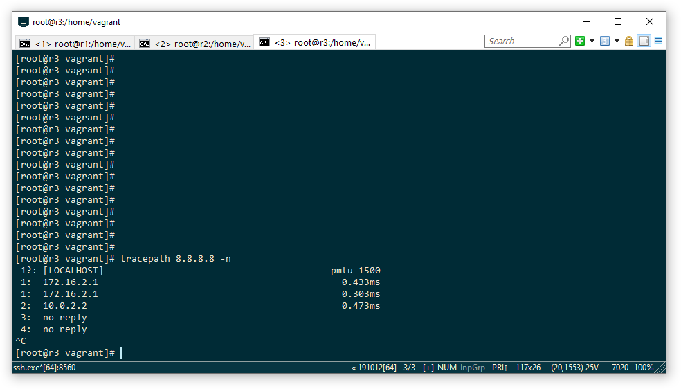

ping 8.8.8.8 с r2

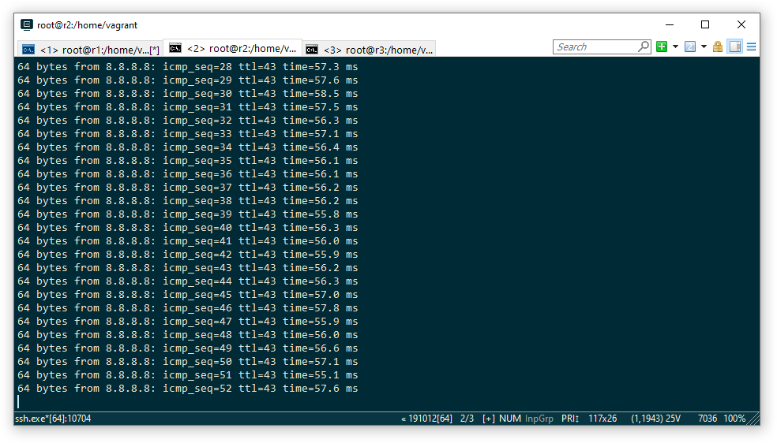

#Ассиметричный роутинг. Отправка пакетов с r4 в 10.0.0.2

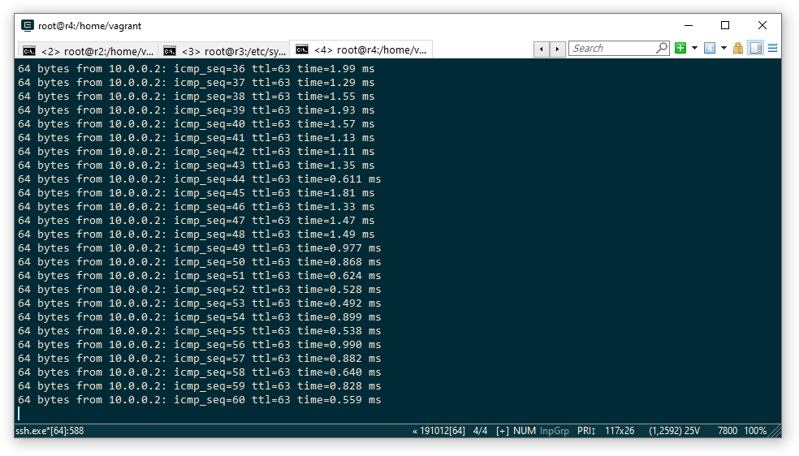

На рисунке показано прохождение пакетов в r3 в разных направлениях

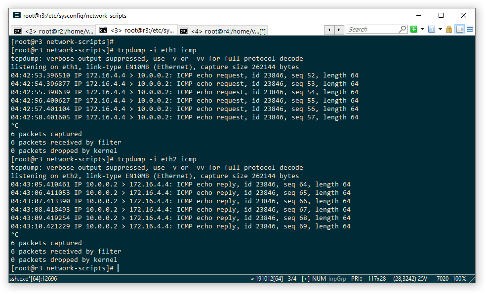

