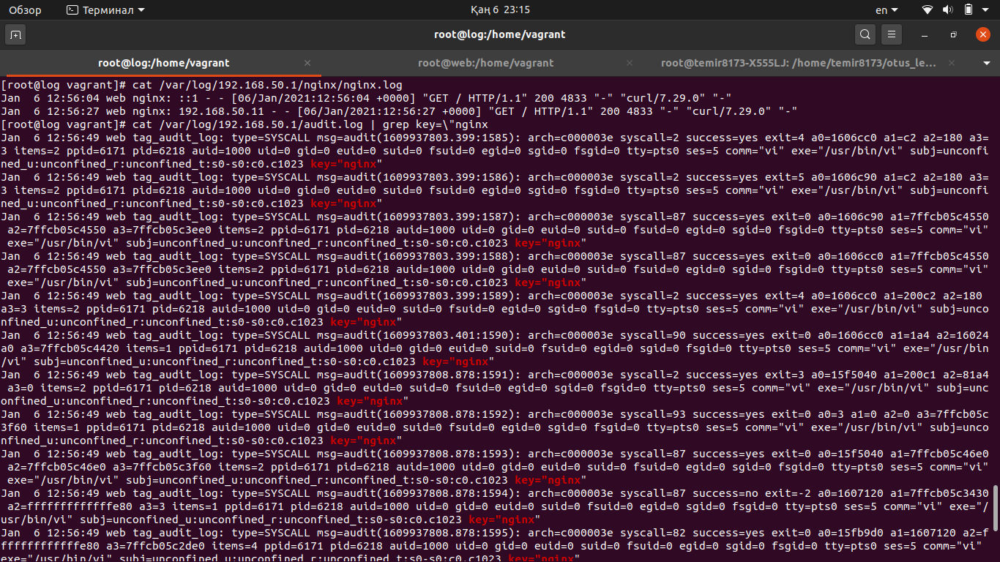
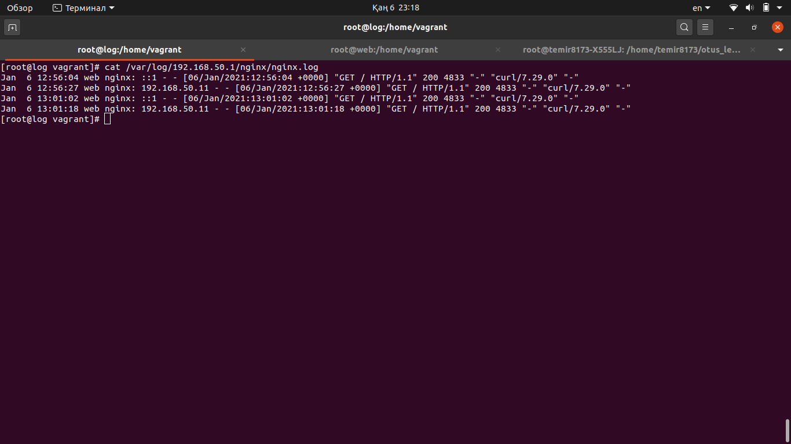
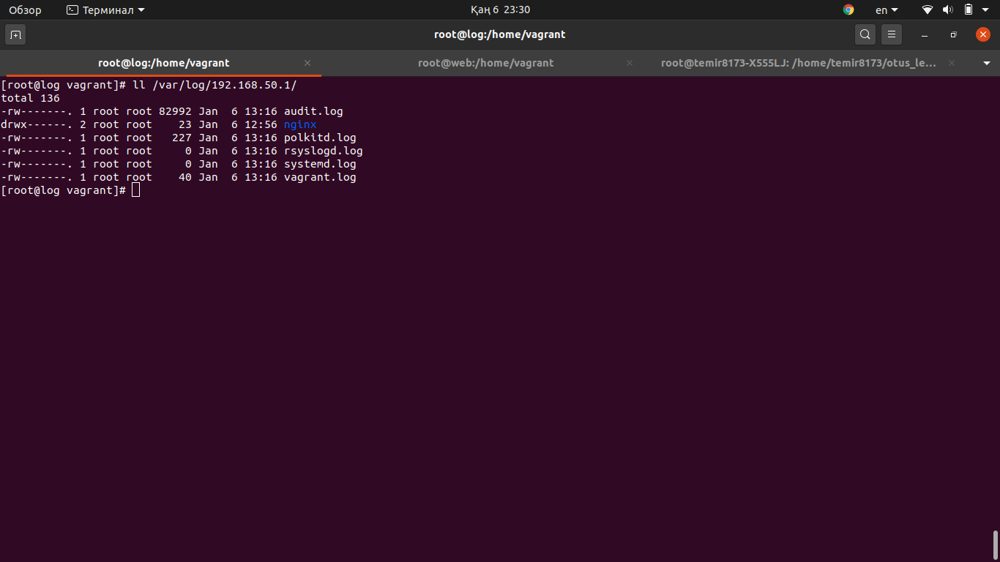

### Настраиваем центральный сервер для сбора логов

в вагранте поднимаем 2 машины web и log
на web поднимаем nginx
на log настраиваем центральный лог сервер на любой системе на выбор
- journald
- rsyslog
- elk
настраиваем аудит следящий за изменением конфигов нжинкса

все критичные логи с web должны собираться и локально и удаленно
все логи с nginx должны уходить на удаленный сервер (локально только критичные)
логи аудита должны также уходить на удаленную систему

Для того чтобы протестировать работу необходимо поднять виртуалки выполнив команду vagrant up

## Результаты

Будем собирать логи с помощью rsyslog.

- Настраиваем конфиг сервера для сбора логов. Сервер будет слушать на порту 514 tcp/udp.
[rsyslog.conf](provisioning/rsyslog-log.conf)

- Настраиваем конфиг сервера с которого будем собирать логи.
[rsyslog.conf](provisioning/rsyslog-web.conf)

- Добавляем правило для критичных логов в директорию /etc/rsyslog.d/, чтобы они сохранялись локально и отправляли на удаленный сервер
[all.conf](provisioning/all.conf)

- Для того чтобы все логи с nginx уходили на удаленный сервер (локально только критичные) конфиг /etc/nginx/nginx.conf приводим в такой вид:

```
error_log /var/log/nginx/error.log crit;
error_log syslog:server=192.168.50.11:514;
...

access_log  /var/log/nginx/access.log main;
access_log  syslog:server=192.168.50.11:514 main;
```
[nginx.conf](provisioning/nginx.conf)

- настраиваем аудит следящий за изменением конфигов нжинкса, добавляем строку,
эти логи будут записываться в audit.log с ключом "nginx":
```
-w /etc/nginx/ -p wa -k nginx
```

[audit.conf](provisioning/audit.conf)

- Теперь настроим логи аудита чтобы они уходили на удаленную систему
```
$ModLoad imfile
$InputFileName /var/log/audit/audit.log
$InputFileTag tag_audit_log:
$InputFileStateFile audit_log
$InputFileSeverity info
$InputFileFacility local6
$InputRunFileMonitor

local6.*   @@192.168.50.11:514
```
[rsyslog-audit.conf](provisioning/rsyslog-audit.conf)

## Тестируем

1) Редактируем конфиг нджинкса(/etc/nginx/nginx.conf) на сервере web

Смотрим на центральном сервере /var/log/192.168.50.1/audit.log


2) Делаем запросы curl-ом на сервер web

Смотрим /var/log/192.168.50.1/nginx/nginx.conf


Все логи приходящие с удаленного хоста будут сохраняться в директории /var/log/192.168.50.1/  и логи каждой команды будут сохраняться в отдельном файле для каждого согласно шаблону:
```
if $fromhost-ip == '192.168.50.1' then {
 $template FILENAME,"/var/log/%fromhost-ip%/%programname%.log"
 *.* ?FILENAME
 stop
}
```

