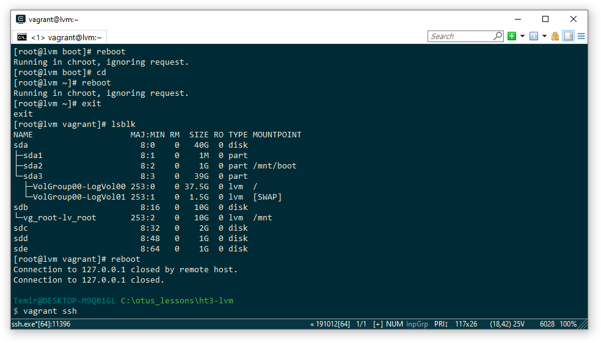
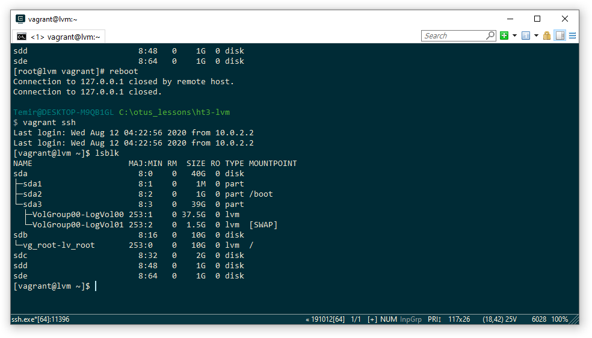
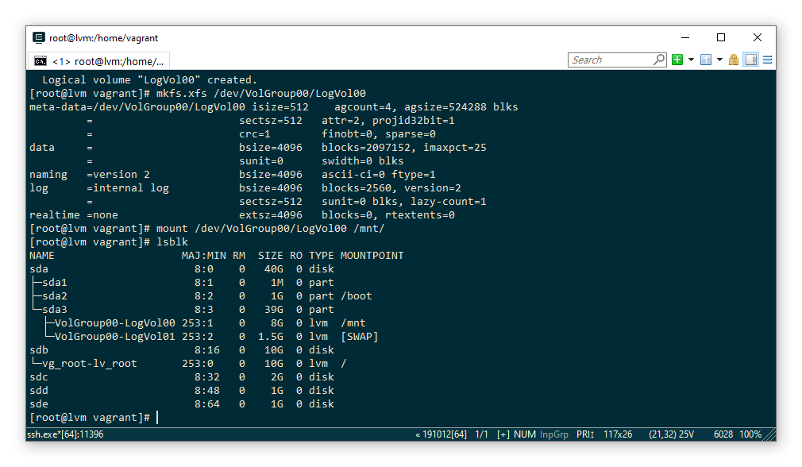
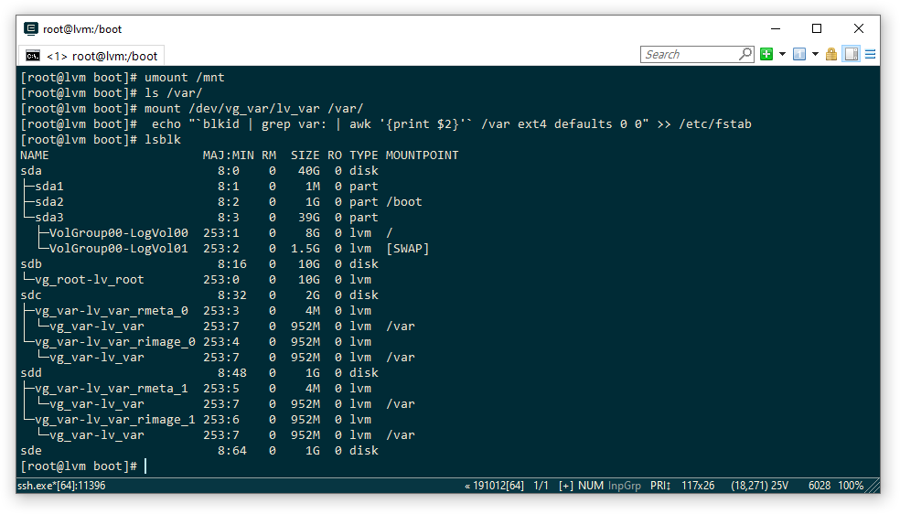
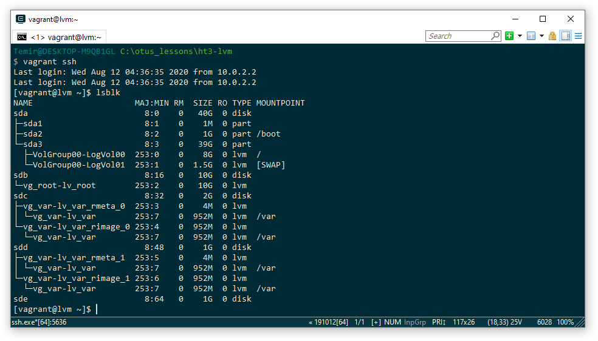
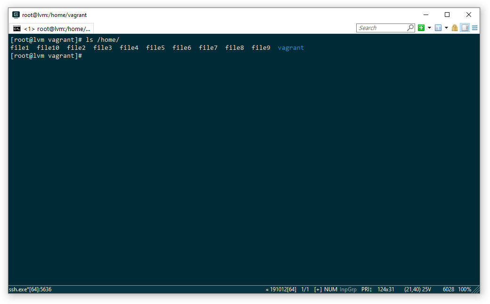

### Работа с LVM

на имеющемся образе
/dev/mapper/VolGroup00-LogVol00 38G 738M 37G 2% /

уменьшить том под / до 8G
выделить том под /home
выделить том под /var
/var - сделать в mirror
/home - сделать том для снэпшотов
прописать монтирование в fstab
попробовать с разными опциями и разными файловыми системами ( на выбор)
- сгенерить файлы в /home/
- снять снэпшот
- удалить часть файлов
- восстановится со снэпшота
- залоггировать работу можно с помощью утилиты script

# 1) Уменþшитþ том под / до 8G

Рисунок 1 - Вывод устройств и точек монтирования до перезагрузки

Рисунок 2 - Вывод устройств и точек монтирования после перезагрузки

Как видно из рисунка 2 после перезагрузки смонитровался нужный root

Рисунок 3 - Удалāем старую LV размером в 40G и создаем новую на 8G, размечаем, монтируем и копируем туда файлы с корневой директории

Далее сымитируем текущий root -> сделаем в него chroot и обновим grub. Обновим образ initrd.
Создаем зеркало на дисках /dev/sdc /dev/sdd
Создаем на нем ФС и перемещаем туда /var
Монтируем новый var в каталог /var
Правим fstab для автоматического монтирования/var

Рисунок 4 - Результат

Рисунок 5 - Перезагружаемся

Удаляем временную Volume Group
Выделяем том под /home по тому же принципу что делали для /var
Правим fstab для автоматического монтирования /home
Сгенерируем файлы в /home/
Снимаем снапшот
Удаляем часть файлов

Рисунок 6 - Содержимое /home после удаления части файлов

Выполняем процесс восстановления со снапшота

Рисунок 7 - Содержимое /home после восстановления со снапшота