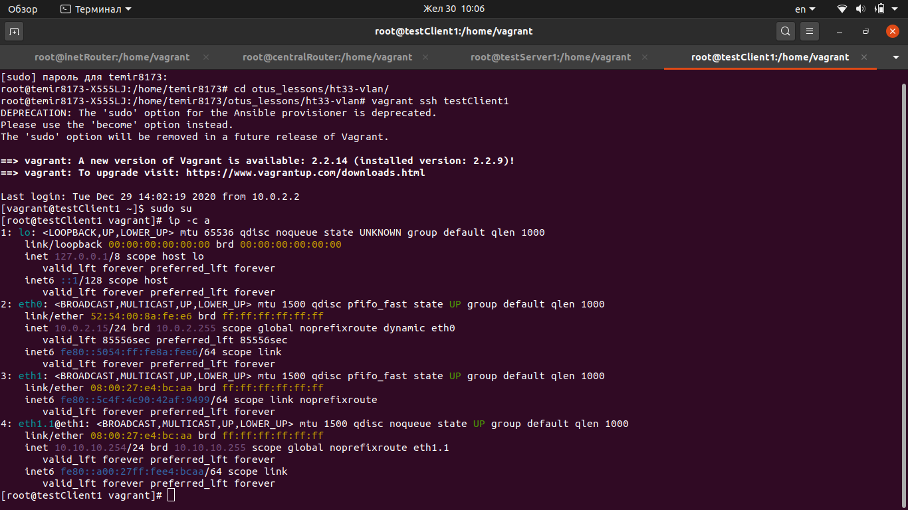
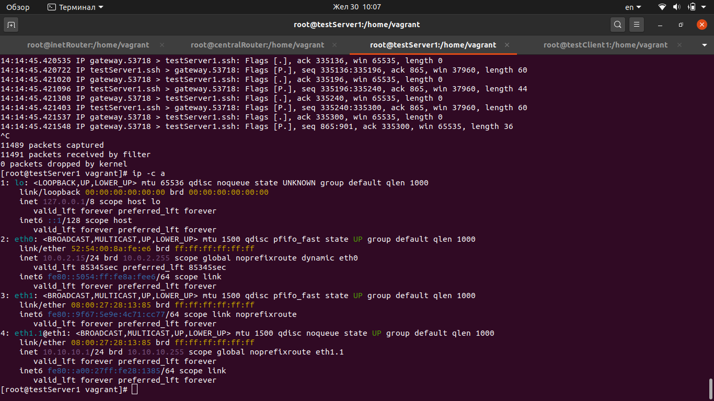
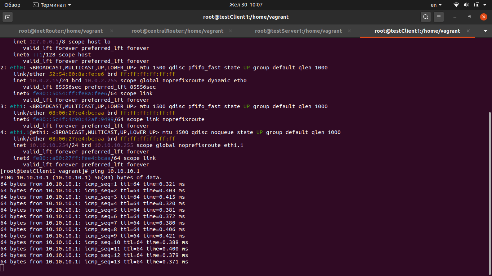
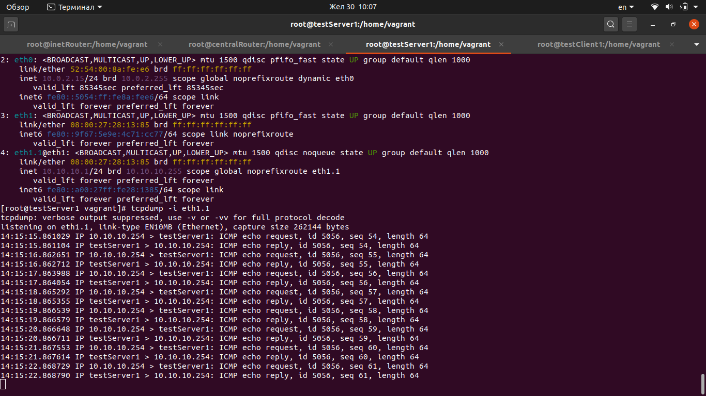
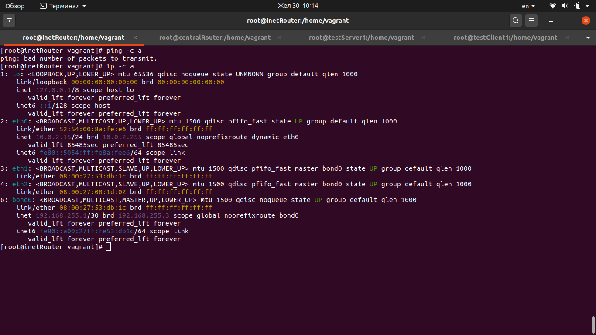
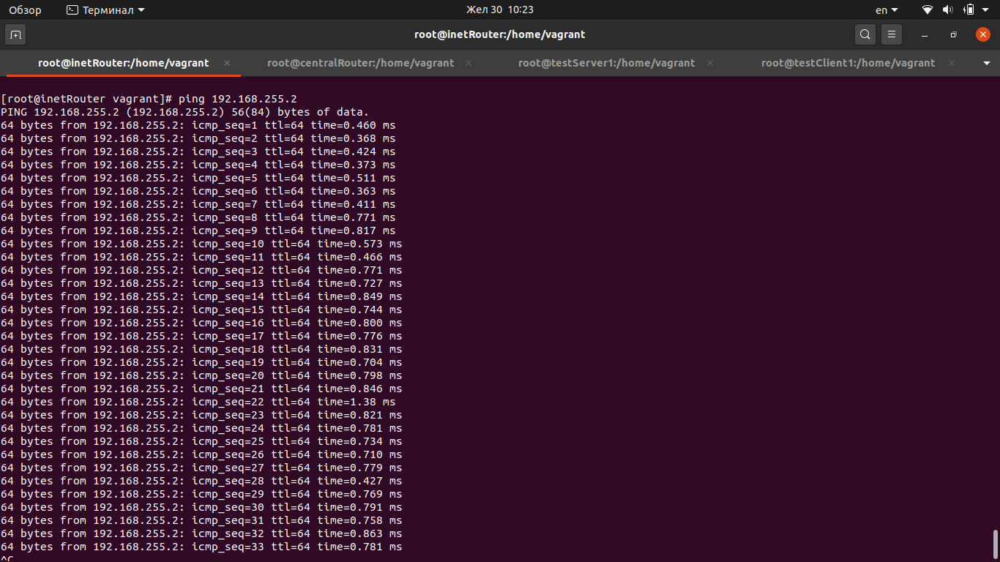
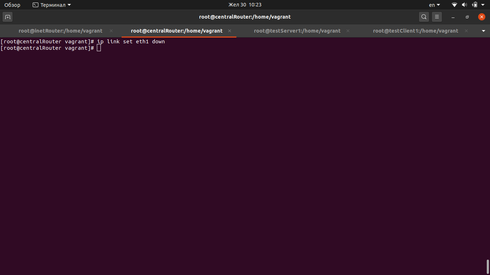
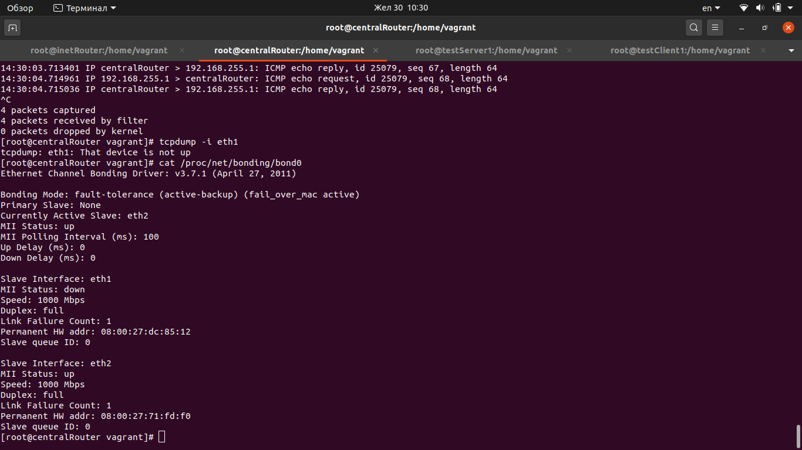

### Строим бонды и вланы

Для того чтобы протестировать работу необходимо поднять виртуалки выполнив команду vagrant up

## Результаты тестирования

# 1. VLAN

в Office1 в тестовой подсети появляется сервера с доп интерфесами и адресами
в internal сети testLAN
- testClient1 - 10.10.10.254
- testClient2 - 10.10.10.254
- testServer1- 10.10.10.1
- testServer2- 10.10.10.1

равести вланами
testClient1 <-> testServer1
testClient2 <-> testServer2

Сетевые интерфейсы на машине testClient1

Сетевые интерфейсы на машине testServer1

Пингуем testServer1 с машины testServer1, пинги идут, все ОК

Смотрим пакеты на стороне testServer1

Для testClient2 <-> testServer2 результат аналогичный

# 2. BOND

между centralRouter и inetRouter
"пробросить" 2 линка (общая inernal сеть) и объединить их в бонд
проверить работу c отключением интерфейсов

Сетевые интерфейсы на inetRouter и centralRouter

Пингуем с inetRouter centralRouter

Отключаем активный интерфейс бонда

Пинги продолжают идти,
Активным подчиненным интерфейсом бонда становится eth2
