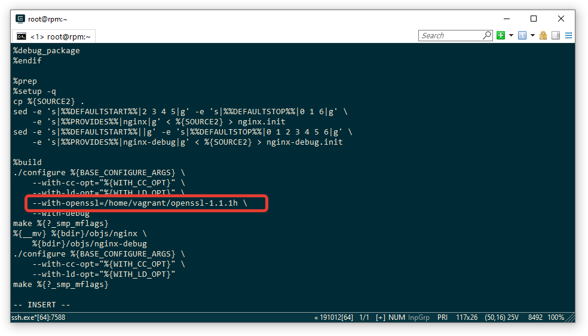
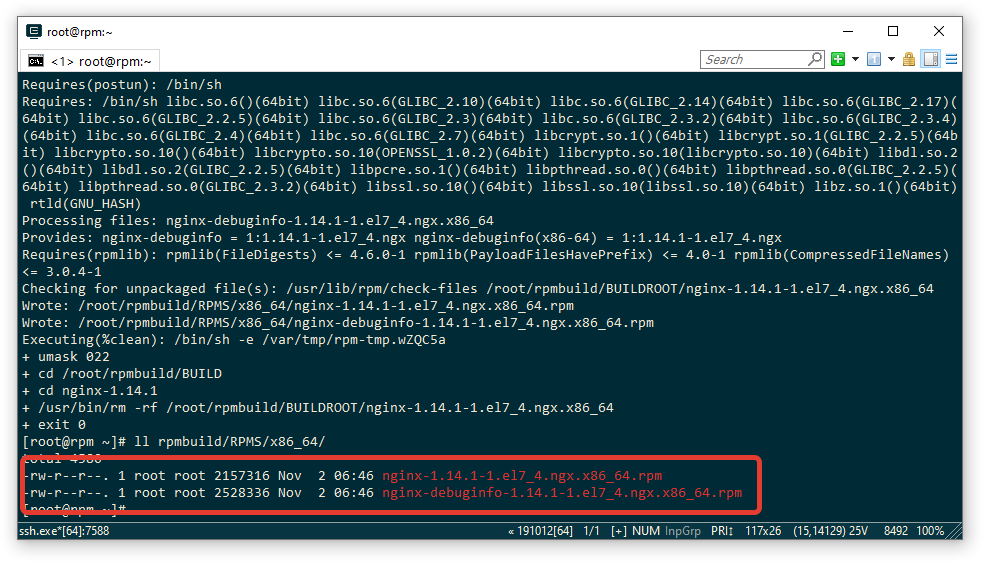
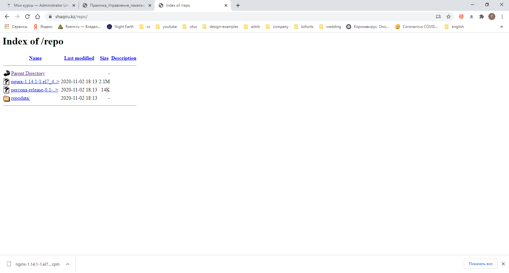
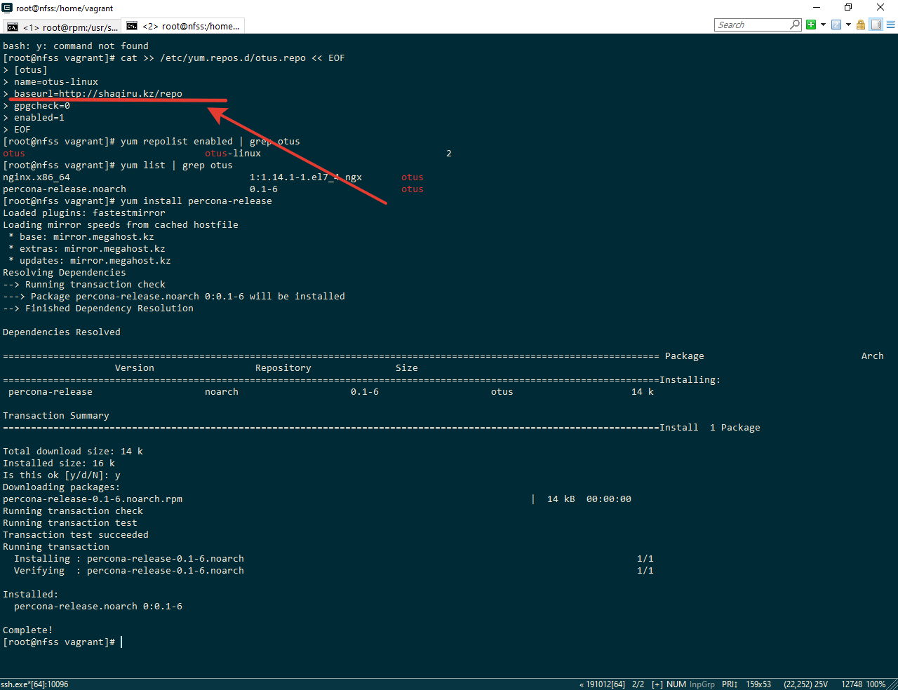

Был взят пакет NGINX и собран с поддержкой openssl

SPEC файл NGINX с необходимыми опциями:

Собираем RPM пакет

rpmbuild -bb rpmbuild/SPECS/nginx.spec

Смотрим пакеты 

Создаем репозиторий

Ссылка на репо - http://shaqiru.kz/repo

Проверяем репо установив пакет percona-release

