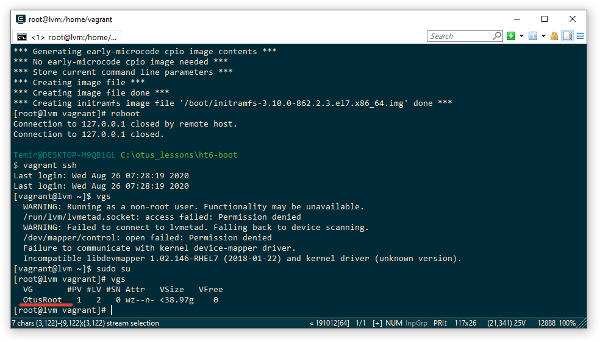

### Работа с загрузчиком

1. Попасть в систему без пароля несколькими способами
2. Установить систему с LVM, после чего переименовать VG
3. Добавить модуль в initrd

4(*). Сконфигурировать систему без отдельного раздела с /boot, а только с LVM
Репозиторий с пропатченым grub: https://yum.rumyantsev.com/centos/7/x86_64/
PV необходимо инициализировать с параметром --bootloaderareasize 1m
Критерии оценки: Описать действия, описать разницу между методами получения шелла в процессе загрузки.
Где получится - используем script, где не получается - словами или копипастой описываем действия.

# 1) Попасть в систему без пароля несколькими способами

Способ 1. init=/bin/sh

Способ 2. rd.break

Способ 3. rw init=/sysroot/bin/sh

# 2) Установить систему с LVM, после чего переименовать VG

# 3) Добавить модуль в initrd

