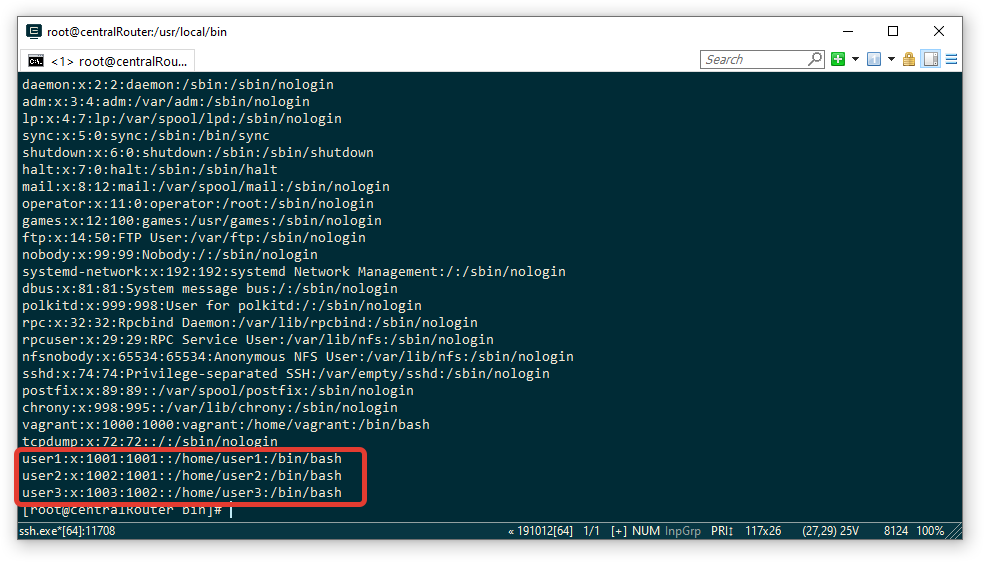
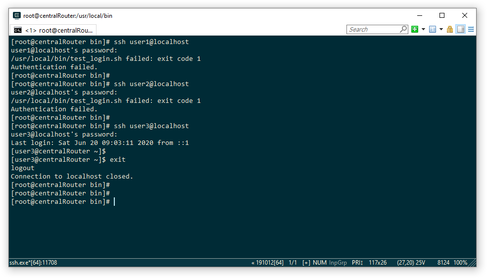

## PAM

#### Запретить всем пользователям, кроме группы admin логин в выходные и праздничные дни

Создадим группы `admin` и `myusers` и добавим пользователей user1, user2 и user3:

```bash
$ groupadd myusers
$ groupadd admin
$ useradd -g myusers user1
$ useradd -g myusers user2
$ useradd -g admin user3
```



Задаем пароли для каждого пользователя:
passwd user1
passwd user2
passwd user3

Для авторизации паролем при ssh запросе меняем настройки ssh /etc/ssh/sshd_config

С "PasswordAuthentication no" на "PasswordAuthentication yes"


Для реализации условии проверки будем использовать модуль pam_exec. Суть заключается в том, что при подключении пользователя будет выполняться скрипт

Добавим в /etc/pam.d/sshd строку  account required pam_exec.so /usr/local/bin/test_login.sh

Создадим сам скрипт /usr/local/bin/test_login.sh (прилагается файл скрипта в этой директории)


```bash
#!/usr/bin/env bash

prazdniki=(1511 0101 0201 0301 0401 0501 0601 0701 0801 2302 \
2402 2502 0803 0903 1003 1103 2904 3004 0105 0205 0905 \
1006 1106 1206 0311 0411 0511 3012 3112)

user_group=`id $PAM_USER | awk ' {print $3} ' | awk -F"(" ' {print $2} ' | awk -F")" ' {print $1} '`

if [[ $user_group = "admin" ]]
  then
    exit 0
elif [[ $user_group = "myusers" ]]
  then
    if [[ " `date +%u` " > " 5 " ]]
      then
        exit 1
    elif [[ " ${prazdniki[@]} " =~ " `date +%d%m` " ]]
      then
        exit 1
    else
      exit 0
    fi
else
  exit 1
fi
```


Результат работы скрипта (на момент тестирования день недели была суббота)



